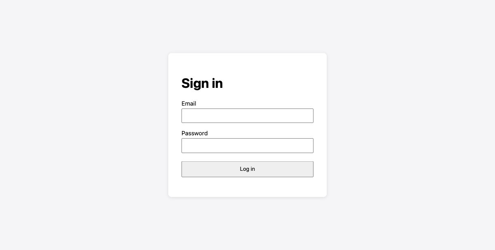

# Bug report: login fails with "Email is required"

**Status:** Fixed and verified. The E2E test passes (unchanged) and the MCP browser shows "Welcome back".

## Summary
A valid user (`test.user@example.com` / `Secure123`) got the alert "Email is required" instead of "Welcome back". The frontend sent the email under the key `username`, but the API (per `Spec.md`) expects `email`.

## Reproduction (before fix)
1. Started the app with `.venv/bin/python app/server.py` (port 3000).
2. Opened `http://localhost:3000/login`. Screenshot: `screenshots/01-login-page.png`.
3. Filled Email = `test.user@example.com` and Password = `Secure123`, then clicked **Log in**.
4. Result: the alert "Email is required" appeared and the page stayed on `/login`. Screenshot: `screenshots/02-failure.png`.

## Evidence (before fix)

| Item | Observed |
|---|---|
| Alert text | `Email is required` (`role="alert"`) |
| Request | `POST /api/login`, `content-type: application/json` |
| Request body | `{"username":"test.user@example.com","password":"Secure123"}` |
| Response | `400 BAD REQUEST`, `{"error":"Email is required"}` |
| Console errors | `400` on `/api/login`; `404` on `/favicon.ico` (unrelated) |
| JS exceptions | None |

## Root cause
`app/static/login.js` (line 12) built the request body with `username: form.elements.email.value`. `app/server.py` reads `data.get("email")`, as `Spec.md` requires, so it saw no email and returned `400 "Email is required"`. The server was correct; the frontend used the wrong key.

## Fix
One line in `app/static/login.js`:

```diff
-      username: form.elements.email.value,
+      email: form.elements.email.value,
```

The test and the server were not changed.

## Verification (after fix)
- `.venv/bin/pytest -v`: `tests/e2e/test_login.py::test_valid_user_sees_welcome_back[chromium] PASSED` (1 passed in 1.92s).
- Playwright MCP, same steps as the reproduction:
  - `POST /api/login` returned `200 OK`.
  - The page shows the paragraph "Welcome back" and no alert.

## Screenshots

**1. Login page before submitting** (`screenshots/01-login-page.png`)



**2. Failure before the fix** (`screenshots/02-failure.png`): the alert shows "Email is required"


**3. Success after the fix** (`screenshots/03-success.png`): the page shows "Welcome back"


## Notes
- The `favicon.ico` 404 is harmless and out of scope.
