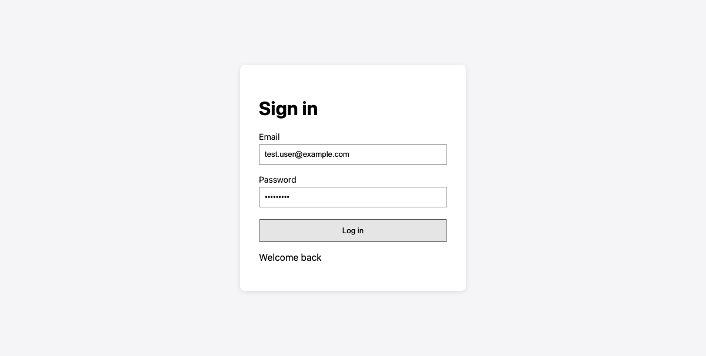
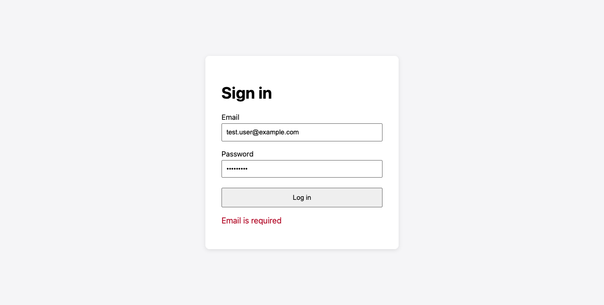

# Login Demo: Debugging with Playwright MCP

A small Flask login app used to practice the **test → reproduce → debug → fix** loop with [Claude Code](https://claude.com/claude-code) and the [Playwright MCP](https://github.com/microsoft/playwright-mcp) server.

> Local environment and test credentials only.

The demo bug: the frontend sent the email under the key `username`, but the API expects `email`, so every valid login failed with "Email is required". It is now fixed. See [BUG_REPORT.md](BUG_REPORT.md) for the full investigation.



## Features
- `GET /login` serves a login page with labeled **Email** and **Password** inputs and a **Log in** button.
- `POST /api/login` takes JSON `{"email": str, "password": str}`.
  - Valid user returns `200 {"message": "ok"}`.
  - Missing email or password returns `400 {"error": "..."}`.
  - Wrong password or unknown user returns `401 {"error": "..."}`.
- On success the page shows "Welcome back". On failure it shows an error alert (`role="alert"`).

Test credentials: `test.user@example.com` / `Secure123`.

## Project layout
```
app/
  server.py            Flask app (port 3000)
  templates/login.html Login page
  static/login.js      Form submit logic
tests/e2e/
  conftest.py          Starts the Flask server for the tests
  test_login.py        Playwright E2E test
screenshots/           Browser evidence (before, failure, success, tables)
Spec.md                Specification
CLAUDE.md              Project rules for Claude Code
BUG_REPORT.md          Bug investigation and fix
MEDIUM_POST.md         Step-by-step write-up
.mcp.json              Playwright MCP config
```

## Setup
Requires Python 3 and Node.js (for `npx`, used by Playwright MCP).

```bash
python3 -m venv .venv
.venv/bin/pip install -r requirements.txt
.venv/bin/playwright install chromium
```

## Run the app
```bash
.venv/bin/python app/server.py
```
Open http://localhost:3000/login.

## Run the tests
```bash
.venv/bin/pytest
# a single file
.venv/bin/pytest tests/e2e/test_login.py
```
`conftest.py` starts its own server on port 3000, so stop any running copy of the app first.

## Using Playwright MCP
`.mcp.json` registers the Playwright MCP server:

```json
{
  "mcpServers": {
    "playwright": {
      "command": "npx",
      "args": ["@playwright/mcp@latest"]
    }
  }
}
```

In Claude Code, run `/mcp` to confirm the server is connected, then ask it to open the app, reproduce an issue, and inspect the console and network requests.

## Reproduce the original bug
In `app/static/login.js`, change `email:` back to `username:` in the request body, restart the app and submit the form. You'll see "Email is required", a `400` from `POST /api/login`, and a failing test.

## Before and after

| | Before | After |
|---|---|---|
| Payload key | `username` | `email` |
| API status | 400 BAD REQUEST | 200 OK |
| Page shows | Email is required | Welcome back |
| pytest | 1 failed | 1 passed |



## Rules for this repo
- Never edit or delete a test just to make it pass.
- Tests use `get_by_label` / `get_by_role`. No CSS selectors, no sleeps.
- Smallest fix in the right place. If stuck after 3 attempts, stop and report.
- Commit messages explain the root cause.
